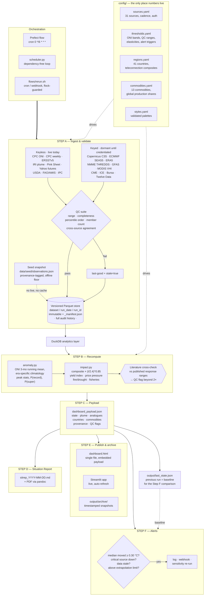

# Architecture

## Why it is shaped this way

**Config is the product.** Every threshold, region, commodity, colour and
cadence lives in `config/`. `src/` contains no magic numbers by policy, and
`config.py` fails loudly at startup if the tree is inconsistent. Adding a
country or a commodity is a YAML append; nothing in the core changes.

**Failure is a state, not an exception.** A dead source produces a stale badge
and an alert, never a crashed run and never a silently substituted number. The
four states — live, cached, seeded, dormant — are all rendered honestly in the
interface, which is why the "sources live" tile is on the front page rather
than buried.

**The store is the audit trail.** Writes are immutable and partitioned by run.
`ParquetStore.as_of()` rebuilds any past state of the dashboard, so the brief's
"treat the previous state as the baseline, preserve full audit history"
requirement is a property of the layout rather than a process anyone has to
follow.

**QC runs against the literature, not just against itself.** Range and
completeness checks catch parser drift. The cross-check against published
response magnitudes catches something more dangerous: a model that is
internally consistent and wrong. It fired on the first build (a +242% palm-oil
response against a published +20–40%) and that is the reason the price chain
looks the way it does now.
